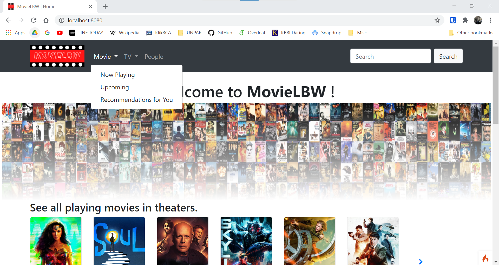

# MovieLBW

MovieLBW is a simple website which shows data about movies, TV shows and celebrities (all data are provided by [TheMovieDB](https://developers.themoviedb.org/3/getting-started/introduction)). MovieLBW does show a list of playing movies in theaters, upcoming movies, recommended movies based on ratings, airing TV shows, recommended TV shows based on ratings and popular people right now. MovieLBW also has a multi-search feature (for movie, TV show and people).

In addition, MovieLBW does have some added values.
* Popularity progress bar which shows how popular a movie, a TV show and a person is.
* Profit (or loss) and return on investment (ROI) of a movie based on its budget and revenue which shows box-office performance of a movie.

### Built With
* [CodeIgniter](https://www.codeigniter.com/)
* [Bootstrap](https://getbootstrap.com/)

## Installation
Please see the [installation section](http://codeigniter.com/userguide3/installation/index.html) of the CodeIgniter User Guide.

## License
Please see the [license agreement](<http://codeigniter.com/userguide3/license.html>).